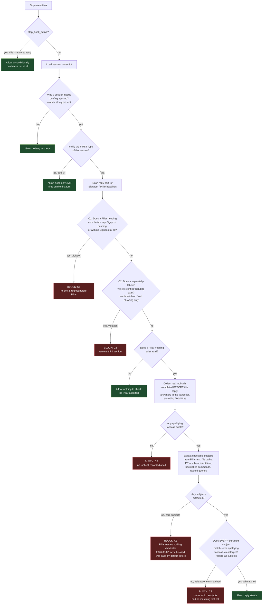

# Archived: first-turn-contract-enforcement (and its C3 sub-sprints)

**Archived**: 2026-09-07, Danny's decision, mid-`first-turn-contract-c3-signpost-sourcing` sprint.

## Why

The mechanism's core approach — parse free-form Pillar prose, guess which fragments are
"claim subjects" (file paths, PR numbers, identifiers, commands), and match them against real
tool-call targets — proved structurally unreliable against LLM-authored text:

- C2 (forbidding a hidden "not yet verified" third section) relied on matching specific
  phrasing of a *concept*, not a controlled or observed vocabulary. It missed real rephrasings
  ("Unverified this session:" vs. "Not yet verified this session:") and a same-day attempt to
  make it structural instead (any non-Signpost/Pillar heading is forbidden) broke on real data —
  ordinary prose sentences ending in a colon were mistaken for headings.
- C3's admission-detection (catching a Pillar that plainly admits "none yet, nothing checked")
  went through two word-hunting redesigns in one day, both shipped with fabricated or
  unreproducible test-corpus numbers, both independently found bypassable by reformatting
  (moving the same words to a bullet line, a blank line, or the heading label).
- The eventual fix that held (§3.4's presence-only fallback flipped to fail-closed, no word
  matching) worked — but surfaced a further, real tension: C3's require-all-subjects rule can
  wrongly block an honest, explicitly-labeled disclosure of one specific unverified item inside
  an otherwise real, verified Pillar.

**Governing principle established this session** (Danny): a hook can only reliably check
against words it *controls* (a literal, forced label the agent is instructed to reproduce
verbatim — e.g. the "Signpost"/"Pillar" headings themselves) or words it *observes* (content
copied verbatim from elsewhere, e.g. the Signpost's own text). Any check that tries to infer a
*concept* from open-ended LLM phrasing — "did this admit non-verification," "is this heading
about being unverified" — is unreliable by construction, no matter how the regex is tuned.

## What's being replaced

A new design, structured around checking off Signpost's own line items one by one (copied
verbatim as rows, each requiring a real, tool-call-backed status) rather than parsing free
Pillar prose for inferred subjects. This satisfies the governing principle directly — the
checklist's row labels are *observed* text, not inferred — and eliminates C2's whole problem
category (there's no free-form "third section" to hide a disclosure in; every row's status *is*
the disclosure).

Scoped as a fresh Intake → spec → forge sprint, not a refactor of the archived code.

## Contents of this archive

Mirrors original repo-relative paths:
- `scripts/`, `reference/` — the probe script (both copies, byte-identical)
- `tests/` — the test suite and corpus fixture
- `.claude/hooks/first-turn-contract.sh` — the Stop-hook wrapper (unwired from
  `.claude/settings.json` as part of this archival)
- `docs/specs/first-turn-contract-enforcement/`, `docs/specs/first-turn-contract-c3-signpost-sourcing/`
- `docs/tooling/first-turn-contract-*` — enforcement doc, both C3 sub-sprint folders, GATE-LOG,
  PROGRESS, and the gitignored track-record log (moved here as-is, not regenerated)

The code at archive time is in its Frank-FAILed, then partially-corrected state — the C3
fabricated-numbers claims were removed and the presence-only fallback fix (with its
`command`-subject extension) was applied and tests pass (35/35); C2 was left in its original,
known-fragile form after a same-day structural-redesign attempt was tried and reverted. This is
kept for its own historical value (the postmortem above), not as a starting point to build from.

## Decision flow at archive time (for reference)

Every block/allow leaf also writes one line to the gitignored track-record log, independent of
what (if anything) is emitted back to Claude Code.
