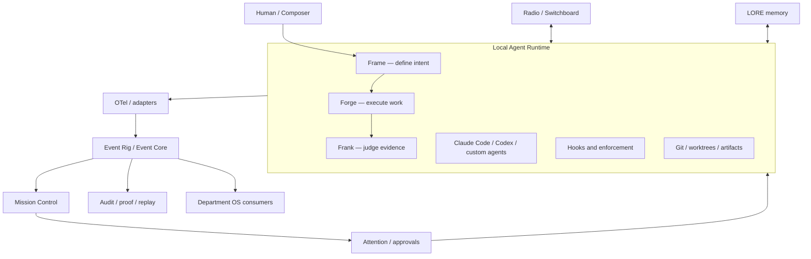
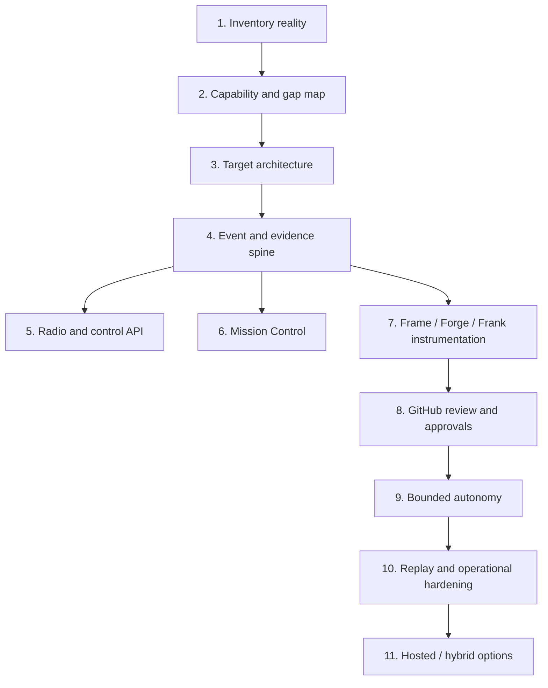

# Agent Rig — Build Ideas Index, System Map, and Next Steps

**Status:** Working canonical index, reconstructed from the Agent Rig project chats  
**Date:** 2026-09-17  
**Purpose:** Consolidate the ideas scattered across the project into one navigable map and one order of operations.

## Bottom line

Agent Rig is the **internal agentic production system**. Department OS is a **separate public-facing product built by that system**. They may share primitives and event infrastructure, but they should not be collapsed into one product or one interface.

The immediate move is not to build another component. It is to inventory what already exists, normalize it into a capability map, identify gaps and overlaps, and then lock the target architecture. The first architectural build slice should be the event/evidence spine that makes all later UI and autonomy trustworthy.

## System map

## Build-idea index

| Area | Build idea | Role / boundary | Current disposition | Next step |
|---|---|---|---|---|
| Product boundary | **Agent Rig** | Internal agentic production system and operating layer | Canonical | Inventory the existing repo, runtime, commands, integrations, and unfinished experiments |
| Product boundary | **Department OS** | Public product built with Agent Rig; consumes shared primitives/events | Decided: separate product | Document the shared-contract boundary; do not merge interfaces or app state |
| Definition | **Frame** | Defines mission, intent, constraints, acceptance criteria, and context | Core component | Inventory current `spec-start`/Frame assets and define emitted lifecycle events |
| Execution | **Forge** | Runs the build process through agents, tools, branches, and artifacts | Core component; `forge-start --lite` exists | Inventory command paths and instrument executions, artifacts, state transitions, and failures |
| Judgment | **Frank** | Independent QC, evidence review, gates, verdicts, and human decision support | Core component | Separate judgment records from enforcement actions; define verdict/evidence schema |
| Enforcement | **Hooks and controls** | Enforce policies, allow/deny actions, require gates, and capture events | Belongs under Enforcement & Controls, not Judgment | Inventory all hooks; classify observe, enrich, block, gate, and mutate; make mutation controls fail-closed |
| Agent runtime | **Durable local runtime / supervisor** | Persistent substrate beneath CLI, TUI, MCP, and web clients; can sleep and wake on demand | Architectural direction | Inventory actual processes and wake/sleep behavior; define supervisor contract and recovery semantics |
| Agent runtime | **Claude Code, Codex, custom agents** | Execution harnesses, not the system of record | Harness-agnostic approach | Normalize their different session/tool/subagent outputs into one event model |
| Communications | **Radio / Switchboard** | Human-agent and agent-agent communications; radio-style conversation model | Core interface concept | Resolve whether Radio is the interaction UX and Switchboard the routing service, or one renamed component |
| Communications | **Radio language and readable transcript** | “Over / Out / Copy,” sign-off, conversational view instead of raw JSON logs | UX direction | Specify message envelope, conversation states, acknowledgements, handoffs, and transcript view |
| Control plane | **Mission Control** | React command center for projects, work, agents, traces, artifacts, gates, attention, and evidence | Core UI; must remain custom, not Grafana | Inventory the existing private agent-dashboard repo and reconcile it with Mission Control |
| Control plane | **Local / hosted / hybrid control plane** | Runtime remains local-capable; control plane may be local, self-hosted, or hosted | Later-stage deployment choice | Define local-first boundaries after the runtime/event contracts are stable |
| Events | **Event Rig / Event Core** | Semantic event layer: normalize, enrich, correlate, persist, query, and replay | Highest-priority architecture spine | Draft canonical event envelope, entity IDs, lifecycle vocabulary, and storage/query requirements |
| Telemetry | **OpenTelemetry / OTLP ingestion** | Collection and transport for traces, tools, sessions, tokens, costs, errors, retries, compaction, MCP, hooks, and skills | Adopt as substrate, not domain model | Build adapters/collector path; map raw telemetry to semantic Agent Rig events |
| Telemetry | **PostHog-inspired adapter** | Product-style events, traces, replay, and observability patterns | Reference to borrow, not necessarily dependency | Identify patterns to reproduce behind an internal adapter; avoid coupling the domain model to PostHog |
| Evidence | **Verification Plane CLI** | Verifies features and architecture against concrete evidence | Adapt/build from PStack concepts | Gap-analysis after inventory; define the smallest CLI slice |
| Evidence | **Feature Maps** | Map claimed features to files, tests, routes, behaviors, and evidence | Proposed first slice | Define schema and generate one map for Agent Rig itself |
| Evidence | **SHA-bound Proof / Verdict Ledger** | Ties evidence and judgment to an exact repository state | Proposed first slice | Define immutable proof, verdict, reviewer, and commit-SHA records |
| Evidence | **Context Packs** | Bounded, reproducible context presented to builders/reviewers | Proposed | Define package manifest and provenance after Feature Maps |
| Evidence | **Architecture Arena** | Compare competing architectural approaches against explicit criteria and experiments | Proposed | Defer until the event/evidence spine can record comparisons faithfully |
| Evidence | **Prototype Loop** | Empirical loop: hypothesis, tracer implementation, evidence, verdict, adaptation | Proposed | Express it as Event Core lifecycle states and exercise it on one tracer bullet |
| Evidence | **Gardener constraints** | Keep the system coherent; prune duplication and uncontrolled conceptual growth | Proposed governance mechanism | Turn constraints into checks only after inventory exposes duplication |
| Memory | **LORE** | Durable, project-scoped memory; Signposts are retrieved claims, Pillars are reverified claims | Existing memory substrate | Inventory capabilities and gaps; do not replace it reflexively |
| Memory | **LORE boundary** | Memory/evidence support, not application state for Agent Rig or Department OS | Decided | Document what belongs in LORE versus Event Core and operational databases |
| Work management | **Git / worktrees / artifacts** | Isolated agent work, reviewable outputs, commit-bound evidence | Core primitive | Inventory branch/worktree lifecycle and connect it to missions, artifacts, reviews, and verdicts |
| Review | **GitHub review loop** | Internal review gate replacing unnecessary paid external review services | Planned | Define PR/commit ingestion, reviewer identity, verdicts, requested changes, and merge authority |
| Human control | **Attention / approval queue** | Routes exceptions, uncertainty, and consequential decisions to the human | Planned | Define attention item types, priority, evidence package, expiry, and resume behavior |
| Autonomy | **Sleeping / wakeable runtime** | Continuous availability without continuous model spend; wake via Discord or another client | Existing precedent / desired behavior | Capture wake triggers, durable state, idempotency, and return-to-sleep rules |
| Autonomy | **Continuation, handoffs, coordinators** | Agents resume, delegate, exchange summaries, and continue bounded work | Later phase | Build only after approvals, event replay, and evidence gates work reliably |
| Observability | **Replay and audit** | Reconstruct what happened, why, with which inputs, tools, agents, and code state | Planned | Make provenance and causality first-class in Event Core from the beginning |
| Data model | **Normalized agent transcript/event corpus** | Preserve human → primary agent → tool/sub-agent → primary agent → human provenance, including recursive depth and resume/message edges | Active adjacent research | Build parser, resolve unexplained child-agent files, normalize sessions, then mine the full corpus |
| Interfaces | **CLI / TUI / MCP / web clients** | Multiple clients over one durable runtime, not separate systems | Architectural direction | Specify one control API and permission model before expanding clients |
| Configuration | **YAML for static topology only** | Suitable for relatively static runtime wiring | Decided constraint | Keep missions, approvals, judgments, events, and history in durable state, not YAML |
| Security | **Fail-closed mutation allowlists** | Prevent agents or interfaces from performing unapproved state-changing actions | Decided constraint | Define mutation classes and explicit authority per actor/client |
| External reference | **HumanLayer** | Patterns for tasks, sessions, artifacts, worktrees, review, and human escalation | Study/borrow selectively | Add to post-inventory comparison matrix |
| External reference | **PStack** | Lauren Tan’s engineering/verification skill stack, used in her Grok Bot + Cursor workflow: feature maps, verification, context packs, architecture comparison, rigorous review loops | Discussed in Agent Rig; high-value reference | Compare Reuse / Adapt / Rebuild / Skip after inventory; do not import wholesale |
| External reference | **A7T / Three-Body** | Patterns for autonomous continuation and agent coordination | Study later | Evaluate after bounded autonomy foundations exist |
| Commercialization | **Hybrid cloud / hosted Agent Rig** | Possible later productization of the control plane | Explicitly late phase | Do not design around commercialization until local architecture proves itself |

## Important distinctions already settled

1. **Agent Rig is not Department OS.** Agent Rig builds and operates; Department OS serves its own users.
2. **OpenTelemetry is plumbing, not meaning.** OTLP can transport signals, but Event Core owns the semantic model.
3. **Mission Control is not Grafana.** It is a stateful React operating interface, not merely a telemetry dashboard.
4. **Hooks are not judgments.** Hooks observe or enforce. Frank, independent review, and humans judge.
5. **LORE is not the operational database.** It supplies durable memory and reverified knowledge, not live app state.
6. **Interfaces are clients.** CLI, TUI, MCP, Radio, and web should sit above one durable runtime/control contract.
7. **No invented system state.** Mission Control and Department OS must show only real events, agents, evidence, artifacts, gates, and metrics.

## Dependencies and build order

## Recommended next steps

### Now — establish reality

1. **Run the Agent Rig inventory.** Cover the `agent-rig` repo, private agent-dashboard repo, LORE, Radio/Switchboard experiments, runtime processes, hooks, GitHub/worktrees, Claude Code/Codex integration, telemetry, deployment, and active branches.
2. **Create a capability register.** For each item record: exists, works, partial, proposed, duplicate, abandoned, owner, repo/path, dependencies, and evidence.
3. **Resolve naming and boundary collisions.** Especially Event Rig vs Event Core; Radio vs Switchboard; agent-dashboard vs Mission Control; Runtime vs control plane.
4. **Draw the as-built architecture.** This is descriptive, not aspirational.

### Next — lock the target

5. **Write the target architecture and deltas.** Explicitly list what is kept, changed, retired, or newly built.
6. **Define the semantic event model.** Start with mission, frame, agent run, tool call, artifact, gate, evidence, verdict, approval, attention item, state transition, message, handoff, failure, retry, and resume.
7. **Define identity and causality.** Stable IDs for project, mission, run, agent, artifact, commit, worktree, event, evidence, verdict, and parent/child relationships.
8. **Choose the operational stores.** Keep LORE separate; choose storage based on event persistence, application state, search, and replay requirements.

### First build slice — prove the spine

9. **Instrument one end-to-end tracer bullet:** Frame → Forge → artifact/commit → Frank → human decision.
10. **Add Feature Map + SHA-bound Proof/Verdict Ledger.** This makes the tracer bullet verifiable rather than merely visible.
11. **Expose the run through a minimal Mission Control view.** Show real state, evidence, attention, and verdicts only.
12. **Add one Radio interaction.** Start/resume the mission and receive a human approval through the same control contract.

### Then — widen safely

13. Add the GitHub review loop and worktree lifecycle.
14. Add attention/approval prioritization and fail-closed mutation permissions.
15. Add replay, recovery, retries, and sleeping-runtime behavior.
16. Compare PStack, HumanLayer, PostHog patterns, and A7T against actual gaps using **Reuse / Adapt / Rebuild / Skip**.
17. Only then add multi-agent continuation, coordinators, hosted control plane, or commercialization work.

## Suggested inventory deliverables

The inventory should produce five artifacts:

1. **Repository and service register** — what exists and where.
2. **Capability matrix** — what each component actually does.
3. **As-built architecture** — current flows and dependencies.
4. **Gap/overlap register** — missing capabilities and redundant experiments.
5. **Decision queue** — the small number of naming, boundary, and architecture decisions blocking the tracer bullet.

## PStack / Grok clarification

We **did discuss PStack in the Agent Rig project**. The canonical source is the PStack package in Cursor’s plugins repository, with a standalone mirror under `backnotprop/pstack`.

Lauren Tan (`@poteto`) is a **Cursor engineer**, not a Grok engineer. The likely source of the memory is that she publicly used PStack inside a broader **Grok Bot + Cursor Cloud Agents** workflow:

- **Grok Bot** coordinates persistent work, context, routines, and handoffs.
- **Cursor Cloud Agents** perform coding work.
- **PStack** supplies rigorous engineering and verification methods.

We did not establish a formal Agent Rig component called “the Grok stack.” We treated PStack and the surrounding workflow as an external reference to assess after the Agent Rig inventory.

## Single next action

Begin with the **Agent Rig inventory**, using the five deliverables above. Everything else—including a PStack/Grok Bot workflow comparison—should be evaluated against that inventory rather than added directly to the architecture.
