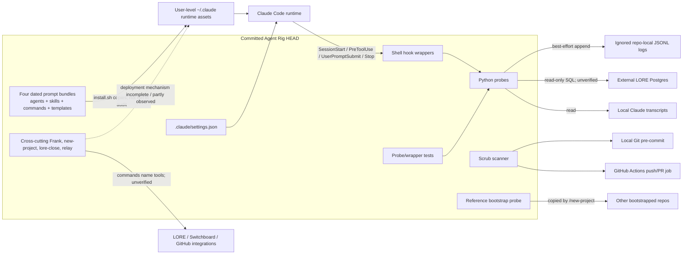

# As-built architecture

## What exists

Agent Rig is a Git repository of Claude-oriented declarative assets plus a small Python/shell control layer. It is not a standalone daemon or application. Its primary products are dated bundles of Markdown agent/skill/command definitions and templates copied into a user-level Claude directory. In parallel, the repository carries project-local hooks and probes that intercept Claude lifecycle events, write ignored JSONL audit trails, and—in one case—read an external Postgres-backed LORE queue.

The package orchestrators are interpreted instructions. Their separation of roles, retry loops, gates, human approval, file writes, and Git actions exist concretely as Markdown contracts, but no executable orchestration state machine in this repository enforces those sequences. Mechanical enforcement is concentrated in Claude hook registration, Python probes, a Git pre-commit hook, and one GitHub Actions scrub job.

## Boundaries and flows

### Source-to-runtime distribution

Each dated package has an `install.sh` that creates `~/.claude/{agents,commands,skills,templates}`, backs up differing destination files, and copies source files. Evidence: `forge-07152026/install.sh:16-95`, `spec-orchestration-07152026/install.sh:13-88`, `lit-synthesis-04292026/install.sh:13-109`, and `notebook-orchestration-04182026/install.sh:16-94`.

Observed runtime copies corroborate this flow: all Forge and Lit comparisons match, most Spec and Notebook comparisons match, while Frank and two Spec templates differ. Cross-cutting root assets do not have a repository installer, even though `README.md:22-28` and `commands/README.md:3-11` call them sources of record. Their deployment path is therefore only partly evidenced.

### Spec and forge flow

`/spec-start` is a Markdown sequence that gates Intake, interviews, delegates to five specialist agents, invokes Frank up to three times, writes progress/snapshots, and asks for human approval (`spec-start.md:51-63`, `:201-218`, `:306-489`, `:495-644`). `/forge-start` then delegates implementation, test writing, execution, QC, and Git operations, followed by a separate Frank gate (`forge-start.md:193-274`, `:310-471`). State is maintained in Markdown `PROGRESS.md` files rather than a typed store.

The runtime enforcement boundary is Claude Code: the repository defines prompts and tool entitlements but does not include the runtime. Consequently, these flows are **Present — unverified**, not proven end-to-end.

### Hook flow

Repo-local `.claude/settings.json:2-49` maps:

- SessionStart → `session-queue.sh`;
- PreToolUse `Edit` → `progress-proof-per-slice.sh`;
- UserPromptSubmit → `no_preamble_reminder.py`;
- Stop → no-preamble wrapper and signpost wrapper.

Wrappers capture stdin into temporary files, run Python probes under a timeout, validate output JSON, and generally fail open. Probe decisions append ignored JSONL telemetry best-effort. The domain-boundary wrapper/probe exists but is absent from settings and has no local manifest, so it has no active local path.

User-level Claude settings separately register the no-preamble and signpost wrappers. Whether project and user registrations both fire is an inference that cannot be settled without runtime evidence; the report does not assume either merge or override behavior.

### Queue and provenance flow

The SessionStart queue probe derives a project ID from ignored `CLAUDE.md`, reads `DATABASE_URL` from an external ignored/runtime `.env`, executes read-only SQL, and injects the returned record as a “signpost” (`session_queue_probe.py:66-149`, `:232-264`, `:267-407`). It also inspects transcript filenames/mtimes for staleness. LORE was intentionally not queried during Phase 1.

The signpost Stop probe later reads the transcript, correlates completed tool calls by ID, and verifies that claimed IDs exist (`signpost_checklist_probe.py:316-480`, `:514-533`). It does not inspect tool results for semantic relevance to each claim. That is a concrete boundary of the implemented provenance check.

### Git publication flow

The local Git hook path is enabled as `.githooks`; pre-commit executes `scripts/scrub_gate.py` on staged content. GitHub Actions runs the same script with `--all` on push and pull request (`.githooks/pre-commit:1-7`, `.github/workflows/scrub-gate.yml:1-17`). The repository has no CI job for its pytest suites.

### State and persistence

- Durable committed state: Markdown prompts/specs/templates, Python/shell code, tests, Git history.
- Local ignored state: four JSONL hook logs, caches, local instructions/configuration.
- External state: LORE Postgres, Switchboard/app messages, GitHub remote, Claude transcripts and user-level installed assets.
- Proposed state: Postgres hook telemetry; current function is a no-op (`hook_telemetry.py:49-52`).

These planes are not interchangeable: installed assets and ignored logs demonstrate local operation but are not reproduced by cloning HEAD.

