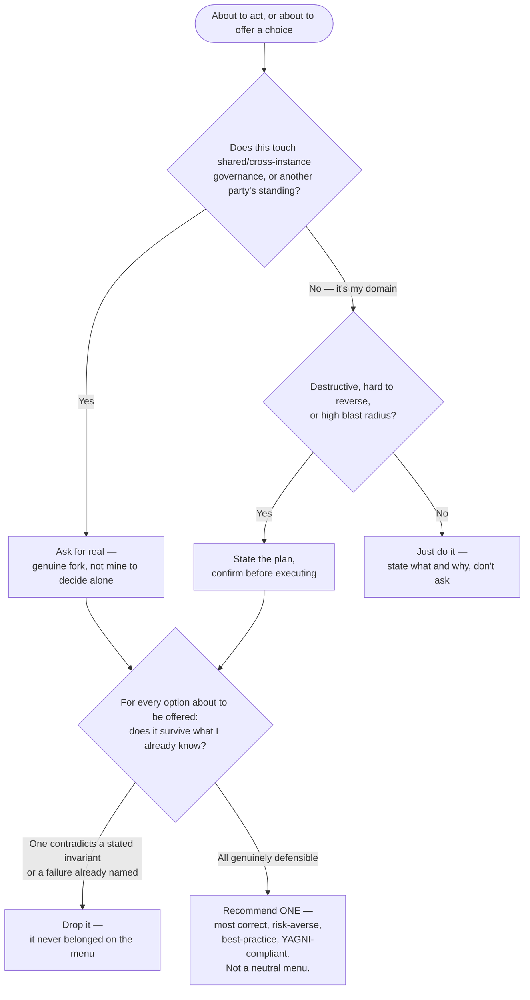

# DDR-001 — Ask-vs-Act Decision Flow

- **Status:** ACCEPTED (confirmed by Danny, 2026-07-17, after the Recommendation-not-menu addition)
- **Author:** wright
- **Date:** 2026-07-17
- **Sprint:** `ask-vs-act-decision-flow`
- **Supersedes:** —
- **GitHub issue:** —

---

## §1 Context

Earlier today (2026-07-17), Cairn caught themselves offering Danny a false choice inside an `AskUserQuestion` call — presenting "commit now or hold" on a change that had already been established, in that same session, to violate a stated invariant, as if both options were neutrally valid. Danny's pushback surfaced the underlying gap directly: nothing distinguishes, as a matter of standing discipline, when an agent should genuinely ask a human from when it should state-and-act or confirm-and-act — and nothing strips an already-known-wrong option off the menu before it's presented.

Cairn built a first-pass fix in response: a 3-question decision flow (Standing → Blast radius → False-choice gate) plus a working `PreToolUse` hook that injects the flow as a reminder before every `AskUserQuestion` call. Verified working (pipe-tested, `jq -e` schema-validated, live-fire proven with a sentinel file and a real trigger). It currently lives only in Cairn's own personal, gitignored `settings.local.json` — deliberately not installed anywhere else, and deliberately not something Cairn will install into another agent's repo themselves, since dispatching or managing other agents' work falls outside Cairn's own North Star.

Danny directed, live in this session, that this be formalized as a DDR + spec and owned by **agent-rig**, not agent-lore/Cairn — matching agent-rig's charter (composing orchestration frameworks, building/refining agents) rather than Cairn's (registrar/memory). Confirmed directly with Danny in-session, not taken on Cairn's relayed word alone.

**Source design** — requested and received verbatim from Cairn (thread `session-start-pattern`, 2026-07-17), full LORE writeup at `lore-personal` doc `3a7c5edd`:

This diagram is the fixed source this DDR builds from, the same discipline DDR-012 established for the Northstar schema: not independently re-derived, not diverged from silently. **One deliberate extension, flagged rather than silent:** the terminal node is renamed from Cairn's original `Present[Present the real choice]` to `Recommend[...]`, per Danny's direction (2026-07-17, see §2) — surviving Q3 means rank-and-recommend, not lay-out-and-wait. Coordinated back to Cairn rather than left as a quiet fork of their design.

---

## §2 Principle

A decision to ask a human should be triggered by two genuinely separate, independently-evaluated axes, not one reflexive "ask or don't" impulse:

1. **Standing** — does this touch shared/cross-instance governance, or another party's standing? If so, it's a genuine fork and asking is real, not ceremony.
2. **Blast radius** — is the action destructive or hard to reverse? If so, the plan gets stated and confirmed before executing, even fully inside the agent's own domain, without needing a Standing-trigger to justify pausing.

Independent of which branch is taken, every option about to be offered to a human must survive contact with what's already established in the current session — an option that contradicts a stated invariant or an already-diagnosed failure doesn't belong on the menu, regardless of how it got there. This is the specific, narrow fix for the incident that produced this design (a false option offered as neutral), not a general "think harder" instruction, and it must not be diluted into one on the way to a spec.

This is a cross-cutting behavioral discipline, not a fix to one agent's habits — the same failure mode (reflexive-ask, or presenting an already-known-wrong option as neutral) can recur in any agent, in any project. Agent-rig owning it as a shared, versioned artifact is the same reasoning DDR-013 already established for Frank.

**Recommendation, not menu** (added 2026-07-17, Danny). Surviving Q3 is not itself the finish line — a flat list of equally-weighted, Q3-cleared options is still a weaker output than it should be. The default output, whenever Q3 resolves to present something, is a single ranked recommendation, not a menu for the human to choose blind among. The recommendation must be:

1. **Most correct** — the best available answer given everything already established in-session, not merely one that survives (surviving is necessary, not sufficient).
2. **Risk-averse** — among defensible options, the one with the smallest, most reversible blast radius.
3. **Aligned with best practices and industry standards** — for the domain in question; a novel or idiosyncratic approach needs a stated reason, it isn't the default.
4. **YAGNI-compliant** — no speculative generality, configuration, or abstraction beyond what the decision at hand actually needs.

A flat menu without a stated recommendation is only appropriate when the decision is irreducibly a preference/values call with no technically correct answer (e.g. project naming, repo visibility) — and even there, the agent states its own lean rather than presenting it neutrally. This criterion applies wherever Q3 is reached, regardless of which upstream branch (Fork or Confirm) produced it.

---

## §3 Decision

### 3.1 Scope of this DDR

This DDR commits agent-rig to taking ownership of formalizing Cairn's decision-flow pattern into a shared artifact, through the standard Intake → spec → forge cadence — it is a decision to build, not the finished design. The mermaid diagram in §1 is the fixed source design.

### 3.2 Deferred to the spec (not decided here)

- Exact artifact shape — hook config, skill, agent-persona doc, or some combination.
- Install/propagation mechanism — global `~/.claude`, per-project, or both.
- Whether this applies only before `AskUserQuestion` or more broadly to other decision points.
- How the False-choice gate (Q3) is actually checked mechanically versus left as a reasoning prompt — Cairn's working hook injects it as a reminder; whether that's the final mechanism or a first pass is a spec-time question.
- Relationship to the Session Start Behaviour 3-check pattern already added to agent-rig's own `CLAUDE.md` this session (2026-07-17) — related self-discipline category, but one is a session-start ritual and this is a per-decision gate; the spec should clarify if/how they compose rather than assume they merge.

### 3.3 Source-of-record

Agent-rig, author≠install-location pattern — same as Frank (DDR-013), same as `/new-project` once DDR-014 lands. Exact deploy target is a spec-time decision, not fixed here.

---

## §4 Risks

| Risk | Mitigation |
|---|---|
| Diverging from Cairn's original design silently | Diagram in §1 is fixed source; any deviation gets coordinated back to Cairn, same discipline DDR-012 established for the Northstar schema |
| Flattening into boilerplate an agent routes around rather than internalizes | Cairn's own incident shows the value is a *live* reminder catching a specific failure mode, not a static doc nobody reads — spec should preserve the injected-reminder mechanism's spirit, not just document the flow in prose |
| Scope creep beyond the specific 3-question gate into a vague "be more careful" mandate | Q1–Q3 are specific and falsifiable by design; spec should preserve that specificity, not generalize it away |

---

## §5 Open Questions

- Final artifact shape and propagation mechanism (§3.2) — spec's call.
- Whether this becomes a new named agent persona (Frank-style) or a skill/hook artifact without persona framing — spec's call.
- How this composes with the Session Start Behaviour checks already shipped today — spec's call, not assumed here.
