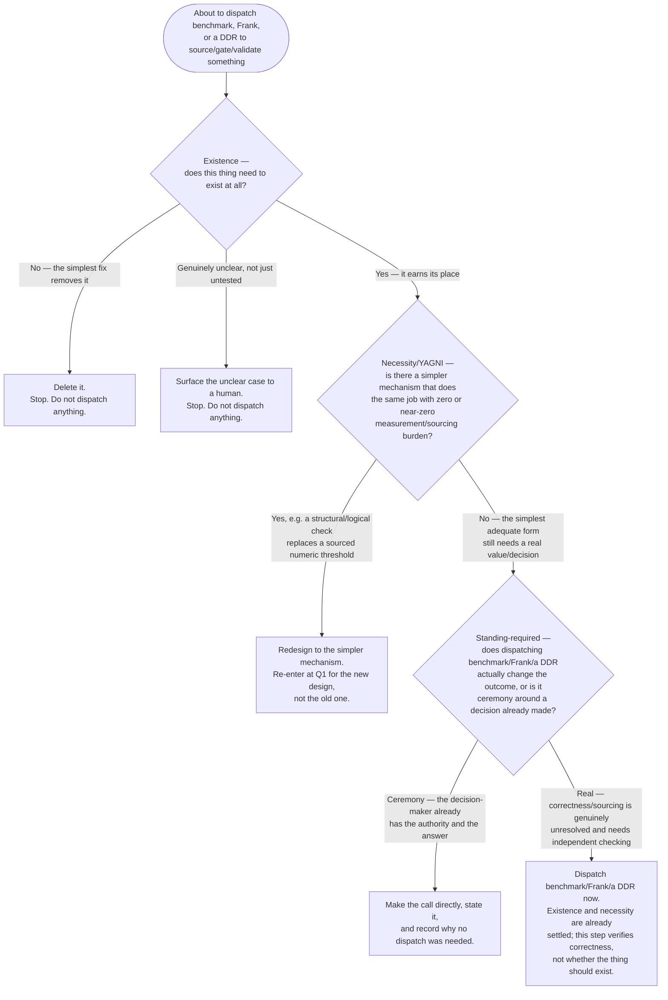

# DDR-012 — Unasked Judgment / Rigor Theater Pre-Dispatch Gate

- **Status:** DRAFT
- **Author:** wright
- **Date:** 2026-09-05
- **Sprint:** —
- **Supersedes:** —
- **GitHub issue:** `dannySubsense/agent-rig#25`

---

## §1 Context

New doctrine landed today (2026-09-05) in `~/.claude/CLAUDE.md`, "Unasked Judgment" section
(immediately after PROMOTED DEFAULT → SHARED WELL → CERTIFIED GARBAGE) —
**UNASKED JUDGMENT → CEREMONY DEFAULT → RIGOR THEATER**. That doctrine text is the canonical
statement of the failure mode; this DDR does not restate it, only the two grounding incidents it
names, briefly:

1. **department-os `MIN_CONTENT_LENGTH`** — 11 independent Frank spec-gate rounds plus a
   `benchmark` agent dispatch, all spent chasing a citation for a constant that simply needed
   deleting. The actual fix was `body.trim().length === 0` — zero measurement required.
2. **agent-rig's own domain-boundary-provenance-hook sprint** — a `{0,1,-1,2}` literal-value
   exclusion set that a `benchmark` agent was dispatched to design a full labeling plan for, in
   order to validate a set that, per Danny's one-sentence call, simply didn't need to exist:
   delete it, ship unfiltered.

Both incidents share the same mechanism, and it is worth naming precisely because it is the thing
this DDR gates: `benchmark`, Frank, and DDR-authoring are all validation/sourcing tools, and each
has a structural bias toward *preserving* the artifact under review — finding a way to source it,
gate it, or formalize it — because judging whether sourcing is even the right response is outside
their job. None of the three is built to answer "should this exist at all?" They are built to
answer "given that this exists, is it justified?" Dispatching one of them before that prior
question is asked guarantees ceremony around something that may not have earned the right to be
ceremonialized.

---

## §2 Principle

A pre-dispatch gate, evaluated before `benchmark`, Frank, or a DDR is invoked for any constant,
threshold, cutoff, exclusion set, or design decision — refining the 3-step draft in issue #25
(Existence → Necessity/YAGNI → Validate) into the same falsifiable, node-by-node shape DDR-001 used
for Q1/Q2/Q3:

**Existence criteria (Q1)** — the node most likely to get skipped under time pressure, so it needs
a concrete checklist rather than the word "judgment":

1. **Can you name the failure mode it prevents, concretely, right now** — not "it seems safer" or
   "it might matter," but a specific input/scenario that goes wrong without it. If you cannot name
   one, that is the answer: it doesn't need to exist.
2. **Was it copied or inherited from somewhere else** (a promoted default, a template, a prior
   sprint's pattern) **rather than derived from this decision's own requirement?** Inheritance
   without re-derivation is itself a PROMOTED DEFAULT signal — treat it as a red flag against
   existence, not a point in favor.
3. **Does removing it change any test, behavior, or output that anyone has actually observed?**
   If the honest answer is "no, nothing currently exercises this," it is speculative and fails
   existence.
4. **Is there already a simpler, structural check that would catch the same failure** (a length
   check, a null check, a type constraint) **without needing a sourced number or a labeling
   effort at all?** If yes, that check is likely the actual fix, and this node should route to Q2
   for confirmation rather than Q3.
5. **Would a human with full context, asked directly and briefly, say "yes, delete it" in one
   sentence?** Both grounding incidents (§1) resolved this way — a one-sentence human call ended
   eleven gate rounds and a full labeling-plan dispatch respectively. If the honest prediction is
   that a one-sentence answer would kill it, ask that question first, before building the
   ceremony around it.

If a constant/decision survives all five, Q1 resolves "Yes" and the flow proceeds to Q2.

---

## §3 Decision

### 3.1 Scope of this DDR

This is a decision to build a mechanism — a `PreToolUse`-style check, or a reminder injected before
`benchmark`/Frank/DDR dispatch, or a prompt-level convention, depending on what proves feasible at
spec time — that surfaces the Q1→Q2→Q3 flow above before those three tools are invoked. It is not
the finished design; the flow in §2 is the fixed source this DDR commits to building from,
mirroring DDR-001's own scope discipline.

### 3.2 Deferred to the spec (not decided here)

- Exact artifact shape — hook, injected reminder, skill update, or briefing-template change to
  `benchmark`'s and Frank's own dispatch instructions.
- Whether this is a mechanized `PreToolUse` check (structural gate) or a prompt-level convention
  (reasoning prompt) — same open question DDR-001 left for its Q3 mechanism, and for the same
  reason: which is feasible is a spec-time question, not a DDR-time one.
- Install/propagation mechanism — global `~/.claude`, per-project, or both.
- Whether Q1's checklist becomes a literal required-answer form (forcing an explicit yes/no per
  criterion) or stays a reasoning aid — spec's call.

### 3.3 Ownership

Agent-rig, same charter basis as DDR-001 — cross-project orchestration mechanics, not scoped to one
project's `benchmark`/Frank instance.

---

## §4 Risks

| Risk | Mitigation |
|---|---|
| This DDR itself becomes ceremony — a "did you ask if this should exist" checkbox that gets rubber-stamped without real judgment, the exact failure mode one level up | Q1's five criteria (§2) are concrete and falsifiable, not a restatement of "use judgment" — a checklist that can't be answered honestly with a checked box alone (each criterion demands a specific named answer: a failure mode, an inheritance source, an observed effect) |
| Over-scoping into a heavy gate that recreates the "more process = more rigor" trap this DDR exists to prevent | The gate's own default outcomes at Q1/Q2 are DELETE or REDESIGN, not "add another review step" — dispatch (more process) is only the Q3 "Real" branch, reached after two prior branches that actively remove work rather than add it |
| Gate gets bolted onto `benchmark`/Frank's own briefing without those two updating their internal assumption that "I was dispatched, therefore something needs validating" | §5 flags the relationship to issue #23's benchmark-mandate review explicitly; not resolved here, but named so it isn't silently missed |
| Existence criteria become a fixed script an agent runs through mechanically rather than actually applies (the exact "flatten into boilerplate an agent routes around" risk DDR-001 named for its own flow) | Same mitigation DDR-001 used: the value is a live check catching a specific failure mode, not a static doc — spec should preserve an injected/interactive mechanism's spirit over a document nobody reads |

---

## §5 Open Questions

- Final artifact shape and mechanism (hook vs. prompt-level convention) — spec's call, per §3.2.
- Whether this applies only to agent-initiated dispatches of `benchmark`/Frank/DDR-authoring, or
  also to human-directed ones (a human explicitly asking for a benchmark run bypasses Q1-Q3, or
  still routes through them as a sanity check?) — not resolved here.
- Relationship to the backlog item at `00-DDR-INDEX.md` ("Benchmark agent as a standing gate step…
  revisit `benchmark`'s own brief," GitHub issue `dannySubsense/agent-rig#23`) — that item concerns
  whether `benchmark` should be a *mandatory* step before Frank; this DDR concerns whether
  `benchmark`/Frank/a DDR should be dispatched *at all*. Adjacent, not identical — sequencing
  and whether one subsumes the other is a spec-time question, not resolved here.
- Whether `benchmark`'s and Frank's own dispatch briefs need updating to assume Q1-Q3 already ran
  (so they don't re-litigate existence themselves) — spec's call.
