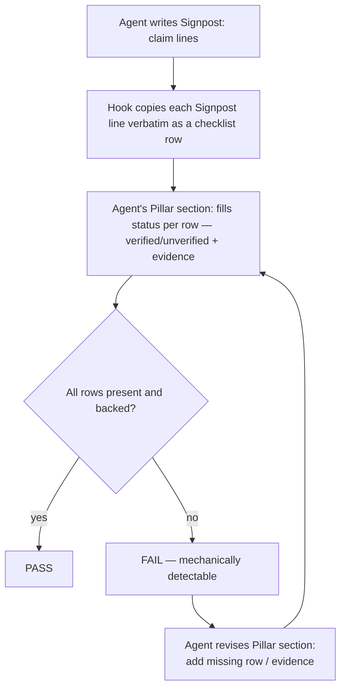

# Intake — Signpost Checklist Redesign

**Status**: APPROVED

## Problem

The archived `first-turn-contract` C1/C2/C3 mechanism (PR #29, `main` @ `b04828e`) word-hunted for
*concepts* in free-form Pillar prose. Root cause: a hook can only reliably check words it
**controls** (a forced literal label) or **observes** (content copied verbatim) — never words it
must infer from open phrasing. You archived the mechanism rather than keep patching it.

## Proposed Direction (your call, 2026-09-07)

Row-based checklist, replacing free-form Pillar prose: copy each Signpost line verbatim as a
checklist row, require a real, tool-call-backed status per row **in the Pillar section**. No
free-form section for an evasion to hide in; row labels are observed text (copied from Signpost),
not inferred concepts, and the Pillar section becomes the row-by-row verification, not open prose.

## FAIL Behavior

FAIL blocks — the agent revises its Pillar section to add the missing row/evidence and resubmits.
No retry-count loop. This is a per-turn mechanical check, distinct from Frank's spec/forge-gate
(which does carry a 3-attempt counter with convergence judgment).

## Open Questions

1. Row key: literal Signpost line, or a normalized/truncated form?
2. Does "tool-call-backed" require cross-referencing actual transcript tool calls, or is a cited
   file:line/command-output self-report sufficient (same trust level as today's Pillar section)?

